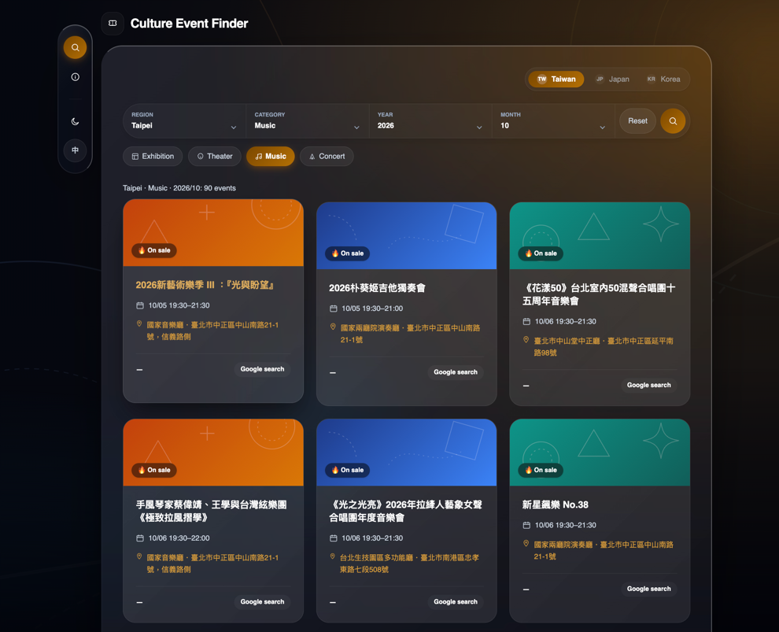

# Culture Event Finder v2

<p align="right">
  <b>English</b> | <a href="readme/README.zh-tw.md">繁體中文</a>
</p>

Culture Event Finder v2 is a modern culture event search platform for Taiwan.
It uses Django 5 on the backend and React with Vite on the frontend.
A multi-stage Dockerfile packages both into one container for easy deployment.



---

## Key Features

1. **Smart Event Grouping**: Groups shows with the same title and venue into one card. Users can open a popup modal to see all dates and showtimes.
2. **Three-Layer Cache & Defense**:
   - Negative cache: Caches upstream failures for 60 seconds to prevent thundering herd.
   - Validation: Strict whitelist validation for cities, categories, and `YYYY-MM` date formats.
   - Request tracking: Injects `X-Request-ID` into every HTTP request.
3. **Clean Single Page App (SPA)**: Router-free state machine with full keyboard and screen reader accessibility. Supports dark and light themes and i18n language toggle.
4. **Single Container Deployment**: Multi-stage build compiles React static files. Django WhiteNoise serves them directly.

---

## Architecture & Request Flow

```
+----------------------------------------------------------------+
|                         User / Browser                         |
|             (Selects city & category, clicks Search)           |
+-------------------------------+--------------------------------+
                                │
                                │ 1. GET /api/v2/events/?...
                                ▼
+----------------------------------------------------------------+
|                    Backend API (Django 5)                      |
|               Validates query against whitelist                |
+-------------------------------+--------------------------------+
                                │
                                │ 2. Check cache
                                ▼
                        /---------------\
                       /   Cache Hit?    \
                       \                 /
                        \---------------/
                         │             │
                   [Yes] │             │ [No]
                         │             │
                         │             │ 3. Fetch raw events
                         │             ▼
                         │     +---------------------------------+
                         │     |    Taiwan MoC Open Data API     |
                         │     +---------------+-----------------+
                         │                     │
                         │                     │ 4. Return event list
                         │                     ▼
                         │     +---------------------------------+
                         │     |    Group Showtimes by Venue     |
                         │     |      & Write to Cache           |
                         │     +---------------+-----------------+
                         │                     │
                         ▼                     ▼
+----------------------------------------------------------------+
|                   Frontend UI (React + Vite)                   |
|        Renders event cards & "N Showtimes" popup modal         |
+----------------------------------------------------------------+
```

---

## Tech Stack

- **Backend**: Python 3.12, Django 5.1, Gunicorn, WhiteNoise, Requests, Pytest
- **Frontend**: TypeScript, React 18, Vite, Tailwind CSS, Lucide Icons, Vitest
- **Package Management**: `uv` (Python), `npm` (Node.js)
- **Deployment**: Docker, Docker Compose, GitHub Actions

---

## Local Development

### 1. Development Mode (Dev)

Run the dev stack with hot reloading:

```bash
make run-dev
```

- Frontend: http://localhost:8790
- Backend: http://localhost:8789
- Stop services: `make stop-dev`

### 2. Production Container Simulation (Prod)

Build and run the production image on port 8791:

```bash
make run-prod
make smoke-prod   # same checks CI runs
```

- Web Service: http://localhost:8791
- Stop container: `make stop-prod`

### 3. Run Automated Tests

Run backend pytest and frontend Vitest suites:

```bash
# Run all tests
make test

# Run backend tests only
make test-backend

# Run frontend tests only
make test-frontend
```

---

## Environment Variables

| Variable | Environment | Description | Example / Default |
|---|---|---|---|
| `ALLOWED_HOSTS` | Production (Required) | Comma-separated list of allowed hostnames. | `localhost,127.0.0.1,0.0.0.0` |
| `DEBUG` | Development | Enables Django debug mode. Defaults to off in production. | `0` (Prod) / `1` (Dev) |
| `PORT` | Production | Gunicorn listening port. | `8791` (Local) / Injected by host |

---

## API Endpoints

| Method | Endpoint | Description | Query Parameters / Response |
|---|---|---|---|
| `GET` | `/healthz` | Service health check | Returns `{"status": "ok"}` with HTTP 200 |
| `GET` | `/api/v2/countries` | List supported countries | Returns `[{"code": "TW", "name": "Taiwan", "supported": true}]` |
| `GET` | `/api/v2/events/` | Search and group culture events | Params: `country` (`TW`), `location` (`臺北`), `category` (`1`), `month` (`YYYY-MM`) |

---

## Render Deployment Guide

1. Log in to your Render Dashboard. Click **New +** and select **Web Service**.
2. Connect your GitHub repository.
3. Configure the service settings:
   - **Region**: Singapore
   - **Environment**: Docker
   - **Dockerfile Path**: `deployment/prod/Dockerfile`
   - **Health Check Path**: `/healthz`
4. Set the Environment Variable:
   - `ALLOWED_HOSTS`: Set to your Render domain (e.g. `culture-event-finder-v2.onrender.com`).
5. Click **Create Web Service** to start the build and deploy.